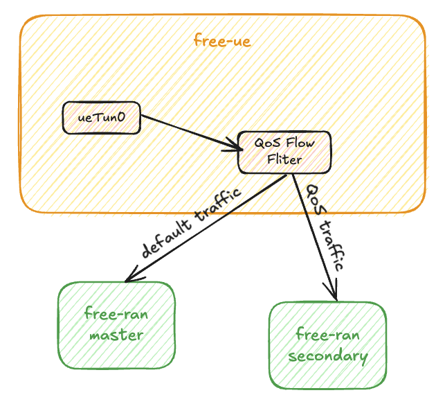

# Static NR-DC

> [!Note]
> Static NR-DC means the DC feature (two tunnels in one PDU Session) will be established during the **PDU Session Establishment Procedure**

## At gNB

In the PDU Session Establishment procedure, after the gNB receives the `ngapPduSessionResourceSetupRequest` and confirms that NR-DC is enabled, the master gNB will forward this REQUEST to the secondary gNB via the Xn interface.

The master gNB will extract the first UL TEID, and the secondary gNB will extract the second UL TEID from the REQUEST.

- For master gNB:

    ```go
    for _, item := range pduSessionResourceSetupRequestTransfer.ProtocolIEs.List {
        switch item.Id.Value {
        case ngapType.ProtocolIEIDPDUSessionAggregateMaximumBitRate:
        case ngapType.ProtocolIEIDULNGUUPTNLInformation:
            ranUe.SetUlTeid(item.Value.ULNGUUPTNLInformation.GTPTunnel.GTPTEID.Value)
        case ngapType.ProtocolIEIDAdditionalULNGUUPTNLInformation:
        case ngapType.ProtocolIEIDPDUSessionType:
        case ngapType.ProtocolIEIDQosFlowSetupRequestList:
        }
    }
    ```

- For secondary gNB:

    ```go
    for _, ie := range pduSessionResourceSetupRequestTransfer.ProtocolIEs.List {
        switch ie.Id.Value {
        case ngapType.ProtocolIEIDPDUSessionAggregateMaximumBitRate:
        case ngapType.ProtocolIEIDULNGUUPTNLInformation:
        case ngapType.ProtocolIEIDAdditionalULNGUUPTNLInformation:
            xnUe.SetUlTeid(ie.Value.AdditionalULNGUUPTNLInformation.List[0].NGUUPTNLInformation.GTPTunnel.GTPTEID.Value)
        case ngapType.ProtocolIEIDPDUSessionType:
        case ngapType.ProtocolIEIDQosFlowSetupRequestList:
        }
    }
    ```

After the secondary gNB extracts the UL TEID from `AdditionalULNGUUPTNLInformation.List[0]`, it will format its DL TEID as a `ngapType.QosFlowPerTNLInformationItem` and send this item as a response back to the master gNB.

```go
// DC QoS Flow per TNL Information
dcQosFlowPerTNLInformationItem := ngapType.QosFlowPerTNLInformationItem{}
dcQosFlowPerTNLInformationItem.QosFlowPerTNLInformation.UPTransportLayerInformation.Present = ngapType.UPTransportLayerInformationPresentGTPTunnel

// DC Transport Layer Information in QoS Flow per TNL Information
dcUpTransportLayerInformation := &dcQosFlowPerTNLInformationItem.QosFlowPerTNLInformation.UPTransportLayerInformation
dcUpTransportLayerInformation.Present = ngapType.UPTransportLayerInformationPresentGTPTunnel
dcUpTransportLayerInformation.GTPTunnel = new(ngapType.GTPTunnel)
dcUpTransportLayerInformation.GTPTunnel.GTPTEID.Value = xnUe.GetDlTeid()
dcUpTransportLayerInformation.GTPTunnel.TransportLayerAddress = ngapConvert.IPAddressToNgap(g.ranN3Ip, "")

// DC Associated QoS Flow List in QoS Flow per TNL Information
dcAssociatedQosFlowList := &dcQosFlowPerTNLInformationItem.QosFlowPerTNLInformation.AssociatedQosFlowList
dcAssociatedQosFlowItem := ngapType.AssociatedQosFlowItem{}
dcAssociatedQosFlowItem.QosFlowIdentifier.Value = 1
dcAssociatedQosFlowList.List = append(dcAssociatedQosFlowList.List, dcAssociatedQosFlowItem)

dcQosFlowPerTNLInformationMarshal, err := aper.MarshalWithParams(dcQosFlowPerTNLInformationItem, "valueExt")
```

When the master gNB receives the response, it will encapsulate the item into the `ngapPduSessionResourceSetupResponseTransfer` and send it back to the core network.

For the core network's implementation, please refer to: [NR-DC Design Document](https://free5gc.org/doc/NR-DC/nrdc/#reference).

## At UE

If the UE is checked to be NR-DC enabled, the UE will establish a secondary connection to the secondary RAN after the PDU session establishment procedure.

In the data plane, when reading raw packets from the TUN device, all packets will go through a destination IP filter. If the packet matches the QoS flow list, it will be sent to the secondary RAN; otherwise, it will be sent to the master RAN by default.

```go
if util.IsIpInQosFlow(buffer, u.nrdc.qosFlow) {
    n, err := u.dcRanDataPlaneConn.Write(buffer)
} else {
    n, err := u.ranDataPlaneConn.Write(buffer)
}
```


